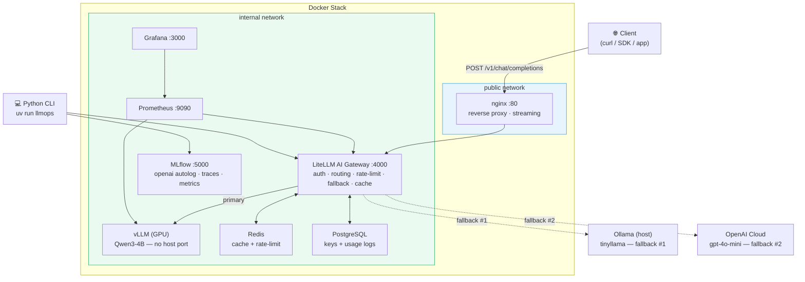
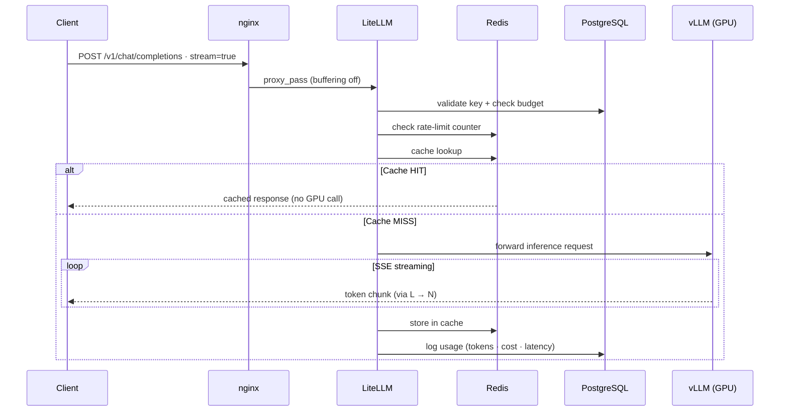
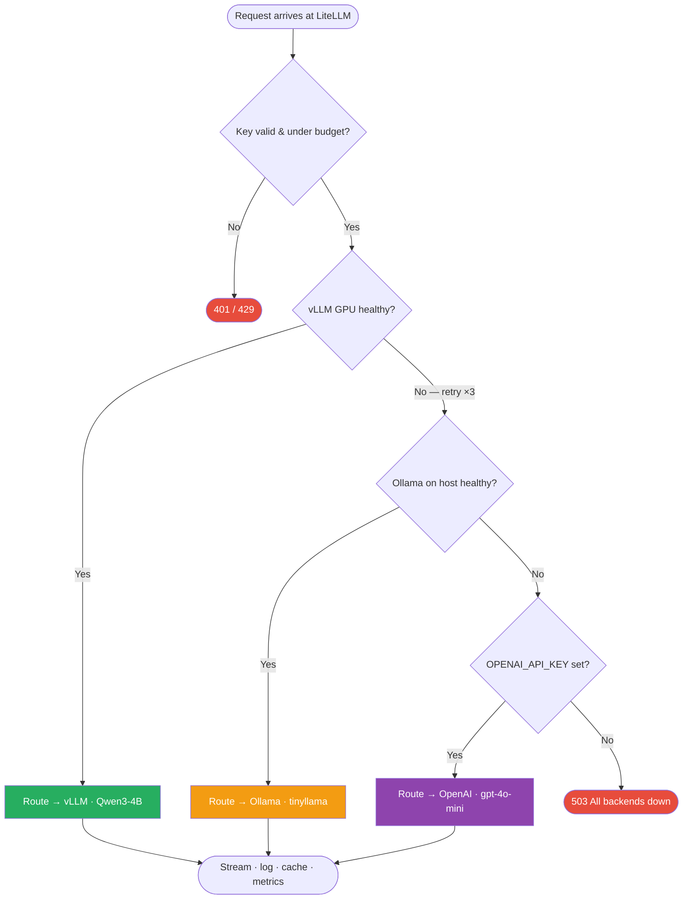
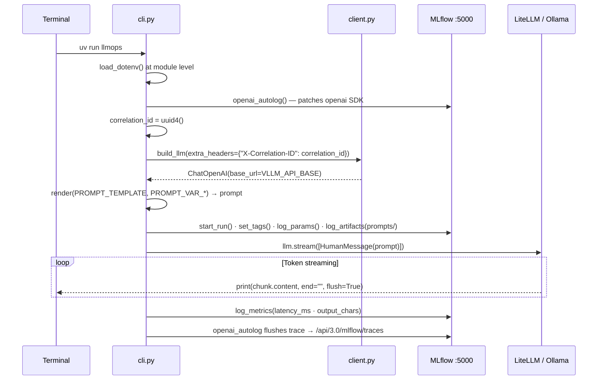
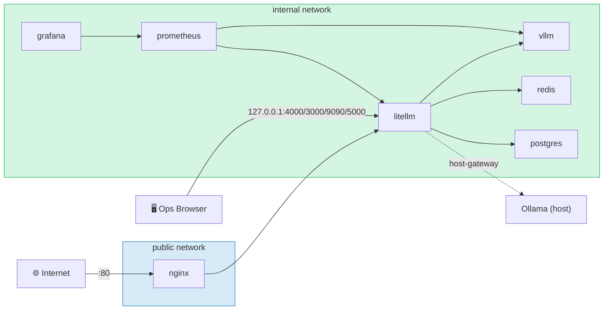

# Architecture

## Overview

vLLMOps is a production-grade self-hosted LLM serving stack. Every external request passes through two layers before reaching the GPU: **nginx** (network/TLS) and **LiteLLM** (AI gateway). No client ever talks to vLLM directly.

Diagrams directory: [`docs/diagrams/`](docs/diagrams/)

---

## System Architecture

> Full diagram: [docs/diagrams/system-architecture.md](docs/diagrams/system-architecture.md)



---

## Request Flow

> Full diagram: [docs/diagrams/request-flow.md](docs/diagrams/request-flow.md)



---

## Fallback Chain

> Full diagram: [docs/diagrams/fallback-chain.md](docs/diagrams/fallback-chain.md)



---

## CLI Flow

> Full diagram: [docs/diagrams/cli-flow.md](docs/diagrams/cli-flow.md)



---

## Network Topology

> Full diagram: [docs/diagrams/network-topology.md](docs/diagrams/network-topology.md)



### Port Reference

| Service | Host binding | Accessible from |
|---|---|---|
| nginx | `0.0.0.0:80` | Internet / all clients |
| LiteLLM | `127.0.0.1:4000` | Host ops browser only |
| Prometheus | `127.0.0.1:9090` | Host ops browser only |
| Grafana | `127.0.0.1:3000` | Host ops browser only |
| MLflow | `127.0.0.1:5000` | Host ops browser only |
| vLLM | *none* | LiteLLM only (internal) |
| Redis | *none* | LiteLLM only (internal) |
| PostgreSQL | *none* | LiteLLM only (internal) |

---

## Component Responsibilities

### nginx — Network Layer
- Single public entry point on port 80
- Future home for TLS termination and WAF rules
- Forwards requests to LiteLLM; has no knowledge of API keys or models
- `proxy_http_version 1.1` + `proxy_buffering off` enable token-by-token streaming

### LiteLLM — AI Gateway
- Virtual API key management (create, revoke, per-key budgets)
- Per-key rate limiting via Redis sliding-window counters
- Model routing: maps `model: "qwen3-4b"` → vLLM backend
- Retry (×3) then fallback: vLLM GPU → Ollama (host) → OpenAI cloud
- Token and spend tracking persisted in PostgreSQL
- Prometheus metrics at `/metrics` (request rates, error rates, latency, cost, token usage)
- Redis exact-match + semantic caching to avoid redundant GPU calls

### vLLM — Inference Engine
- OpenAI-compatible API (`/v1/chat/completions`)
- GPU-accelerated; requires NVIDIA driver + Container Toolkit
- No host port — only reachable from LiteLLM on the internal Docker network
- Exposes `/metrics` for Prometheus (TTFT, TPS, KV-cache hit rate, GPU utilisation)
- Health-checked at `/health`; depends-on chain enforces startup order

### Redis — Cache & Rate Limit Store
- Exact-match and semantic response caching (LRU eviction at 512 MB)
- Sliding-window counters for LiteLLM per-key rate limiting
- Append-only log (`appendonly yes`) for durability across restarts

### PostgreSQL — Persistent State
- Virtual API key registry (create/revoke/budget assignments)
- Per-request usage logs (tokens, cost, latency, model, key)
- Spend budget tracking and alert thresholds
- LiteLLM runs Prisma schema migrations automatically at startup

### Prometheus — Metrics Collection
- Scrapes vLLM at `vllm:8000/metrics` every 5 s
- Scrapes LiteLLM at `litellm:4000/metrics` every 5 s
- Evaluates alert rules from `prometheus/alerts.yml` every 30 s
- `scrape_timeout: 4s < scrape_interval: 5s` (Prometheus requirement)

### Grafana — Dashboards
- Queries Prometheus for both vLLM and LiteLLM metrics
- Two provisioned dashboards: `vllm_dashboard.json` + `litellm_dashboard.json`
- `disableDeletion: true` — provisioned dashboards cannot be deleted via the UI

### MLflow — Experiment Tracking (CLI)
- Image `v3.16.0`, single-worker uvicorn (`--workers 1`), 1 GB memory limit
- `openai_autolog()` in the CLI patches the openai SDK to capture traces; records at `/api/3.0/mlflow/traces`
- CLI connects via `MLFLOW_TRACKING_URI=http://localhost:5000`
- Backend store: SQLite (`mlruns.db`) bind-mounted from host; artifacts in `./mlruns` served via `--serve-artifacts`

### Python CLI (`uv run llmops`)
- `load_dotenv()` runs at module level (before mlflow import) so `MLFLOW_DISABLE_AGENT_HINT` is set in time
- Always uses `ChatOpenAI` pointed at `VLLM_API_BASE` (LiteLLM gateway); Ollama fallback is handled inside LiteLLM
- Generates a `uuid4` correlation ID per run — set as `run.correlation_id` MLflow tag and forwarded as `X-Correlation-ID` header, linking the MLflow run to LiteLLM/nginx access logs
- Tags every run with: `mlflow.user` (RUN_USER), `user.email` (RUN_EMAIL), `env` (APP_ENV), `app.version`, `run.correlation_id`, and optionally `git.commit` (GIT_COMMIT, CI only)
- Logs params: `model`, `api_base`, `prompt_template`, `prompt_chars`, `prompt_var.*` (one param per template variable)
- Logs metrics: `latency_ms`, `output_chars`, `prompt_tokens`, `completion_tokens`, `cost_usd` (computed from `PROMPT_TOKEN_COST` + `COMPLETION_TOKEN_COST` rates; defaults to `0.0` for self-hosted inference)
- Logs artifacts under `prompts/`: `rendered.txt`, `variables.json`, `<name>.j2` (template source)
- After streaming, calls `feedback.collect()` — prompts interactively if stdin is a TTY; `FEEDBACK=good|bad` env var bypasses the prompt for CI/scripting; no-op if neither is set

### Human Feedback (`feedback.py`)
- `feedback.collect()` runs at the end of every CLI inference run, still inside the active MLflow run context
- TTY path: prints `Feedback [g=good  b=bad  Enter=skip]:` after the streamed response; reads one line from stdin
- Env-var path: `FEEDBACK=good|bad` logs immediately without prompting — for CI, batch evaluation, or scripted pipelines
- Non-TTY with no `FEEDBACK` set: silent no-op (piped output, background jobs)
- Logs `feedback` metric (`1.0` = good, `0.0` = bad) and `feedback_label` tag on the run
- DPO/RLHF dataset export: `mlflow.search_runs(filter_string="metrics.feedback >= 0")` returns all labelled runs with full prompt artifacts and traces

### Model Registry (`uv run llmops-register`)
- Config-catalog pattern: each registered model version records a `serving_config.json` (base model + quantization + adapter) linked to a dedicated MLflow run in the `vllmops-registry` experiment
- Uses MLflow 3.x aliases (`champion`, `challenger`) instead of deprecated stages — `MlflowClient.set_registered_model_alias()` is the promotion API
- `MLFLOW_REGISTER_MODEL` names the registered model; `MODEL_QUANTIZATION`, `MODEL_ADAPTER`, `MODEL_ALIAS` are optional serving metadata
- Deliberate operation: run once per new variant, not once per inference call
- `pyfunc.load_model()` on a version is not supported — vLLM owns the weights; MLflow tracks provenance only

### Eval Harness (`uv run pytest tests/evals/`)
- Pattern-based golden regression suite; validates output quality against `expected_patterns` (Python `re.search`)
- Cases defined in `tests/evals/fixtures/golden.yaml` as data — add cases without touching Python
- Each case creates its own `mlflow.start_run()` in the `vllmops-evals` experiment; logs `latency_ms`, `output_chars`, `passed` metric, `output.txt`, and prompt artifacts
- Uses `.invoke()` (not `.stream()`) — tests need the full output to assert patterns
- `max_latency_ms` per case acts as a latency regression gate; default 60 s is generous for the Ollama fallback
- `mlflow.evaluate()` is the next layer: aggregate scoring with an LLM-as-judge once a judge model is configured

---

## Scaling Path

To scale inference horizontally, add additional vLLM nodes to `litellm/config.yaml` under the same `model_name`. LiteLLM's `least-busy` router distributes requests across them — no nginx changes required.

```yaml
model_list:
  - model_name: qwen3-4b
    litellm_params:
      model: openai/Qwen/Qwen3-4B-Instruct-2507
      api_base: http://vllm-node-1:8000/v1
      api_key: "none"

  - model_name: qwen3-4b           # same virtual name, second GPU node
    litellm_params:
      model: openai/Qwen/Qwen3-4B-Instruct-2507
      api_base: http://vllm-node-2:8000/v1
      api_key: "none"
```

---

## Resource Limits (per container)

| Service | Memory limit | CPU limit | Notes |
|---|---|---|---|
| vLLM | 24 GB | 8 cores | Capped so a runaway job can't starve the obs stack |
| LiteLLM | 1 GB | 2 cores | |
| PostgreSQL | 1 GB | 1 core | |
| Prometheus | 1 GB | 1 core | |
| Redis | 768 MB | 0.5 cores | Internally limited to 512 MB (LRU eviction) |
| Grafana | 512 MB | 0.5 cores | |
| MLflow | 1 GB | 1 core | 3.x starts at ~750 MB; 512 MB causes OOM restarts |

---

## Alert Rules (`prometheus/alerts.yml`)

| Alert | Condition | Severity |
|---|---|---|
| VLLMDown | `up{job="vllm"} == 0` for 1 m | critical |
| VLLMHighGPUMemoryUsage | KV-cache > 90% for 5 m | warning |
| VLLMHighQueueDepth | Waiting requests > 10 for 2 m | warning |
| LiteLLMDown | `up{job="litellm"} == 0` for 1 m | critical |
| LiteLLMHighErrorRate | Error rate > 10% for 2 m | warning |
| LiteLLMAllBackendsDown | Error rate = 100% for 1 m | critical |
| LiteLLMHighP95Latency | P95 latency > 60 s for 5 m | warning |
