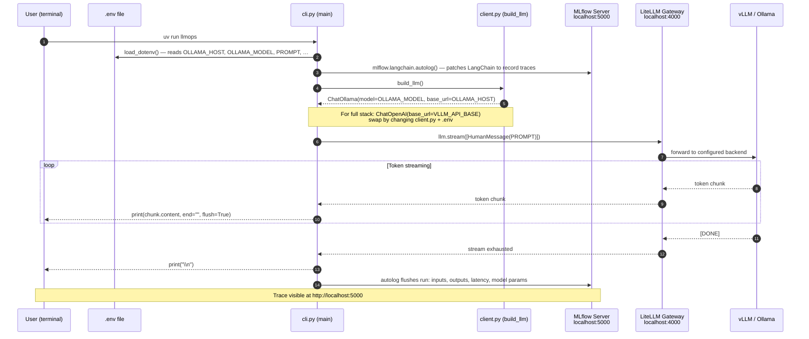

# CLI Flow — `uv run llmops`

How the Python CLI processes a prompt and records the trace.

## Local dev vs. full stack

| Mode | `build_llm()` returns | Backend hit |
|---|---|---|
| `uv run llmops` (local) | `ChatOllama` | Ollama on host :11434 |
| `uv run llmops` (full stack) | `ChatOpenAI` pointing at LiteLLM | nginx → LiteLLM → vLLM |

Switch by editing `src/llmops/client.py` and the relevant `.env` vars.
