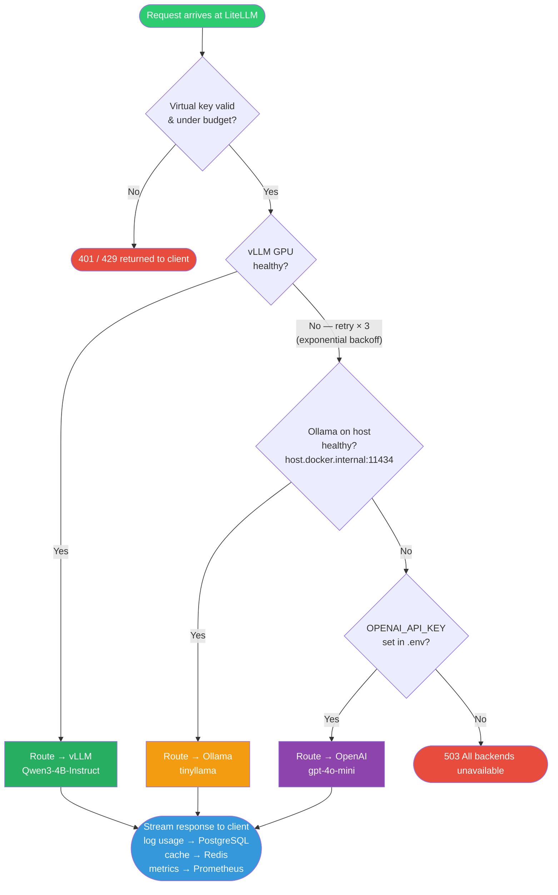

# Fallback Chain

How LiteLLM routes a request when the primary backend is unavailable.



## Fallback Configuration (`litellm/config.yaml`)

```yaml
router_settings:
  routing_strategy: least-busy
  num_retries: 3

fallbacks:
  - {"qwen3-4b": ["tinyllama"]}     # GPU down → local Ollama
  - {"tinyllama": ["gpt-4o-mini"]}  # Ollama down → OpenAI cloud
```
