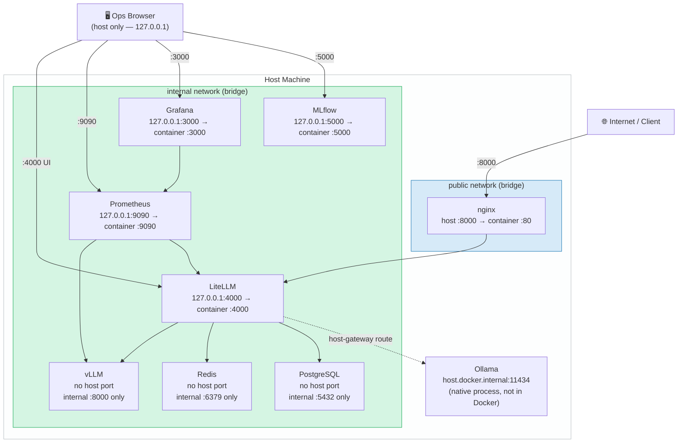

# Network Topology

Docker network isolation: which containers live on which network, and what host ports are bound.

## Port reference

| Service | Host binding | Purpose |
|---|---|---|
| nginx | `0.0.0.0:8000` | Public API entry point |
| LiteLLM | `127.0.0.1:4000` | Ops UI + key management |
| Prometheus | `127.0.0.1:9090` | Metrics UI |
| Grafana | `127.0.0.1:3000` | Dashboards |
| MLflow | `127.0.0.1:5000` | Experiment tracking |
| vLLM | *none* | Internal only — no direct access |
| Redis | *none* | Internal only |
| PostgreSQL | *none* | Internal only |

Observability ports are bound to `127.0.0.1` — reachable from the host browser but not the LAN.
