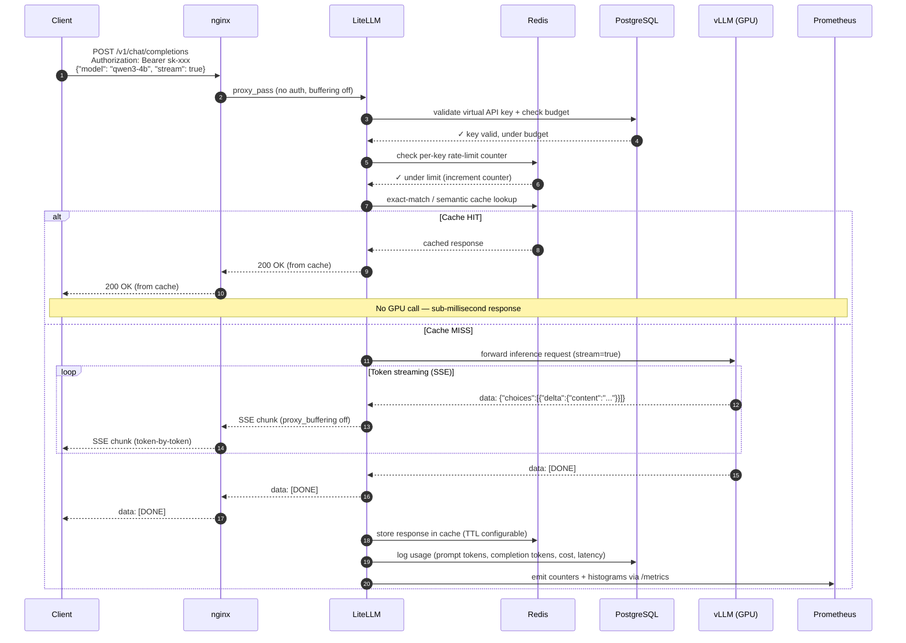

# Request Flow — Chat Completion (streaming)

End-to-end sequence for a single `/v1/chat/completions` request.

```mermaid
sequenceDiagram
    autonumber
    participant C  as Client
    participant N  as nginx
    participant L  as LiteLLM
    participant R  as Redis
    participant P  as PostgreSQL
    participant V  as vLLM (GPU)
    participant Pr as Prometheus

    C  ->> N  : POST /v1/chat/completions<br/>Authorization: Bearer sk-xxx<br/>{"model": "qwen3-4b", "stream": true}
    N  ->> L  : proxy_pass (no auth, buffering off)

    L  ->> P  : validate virtual API key + check budget
    P  -->> L : ✓ key valid, under budget

    L  ->> R  : check per-key rate-limit counter
    R  -->> L : ✓ under limit (increment counter)

    L  ->> R  : exact-match / semantic cache lookup
    alt Cache HIT
        R  -->> L : cached response
        L  -->> N : 200 OK (from cache)
        N  -->> C : 200 OK (from cache)
        note over C,Pr: No GPU call — sub-millisecond response
    else Cache MISS
        L  ->> V  : forward inference request (stream=true)

        loop Token streaming (SSE)
            V  -->> L  : data: {"choices":[{"delta":{"content":"..."}}]}
            L  -->> N  : SSE chunk (proxy_buffering off)
            N  -->> C  : SSE chunk (token-by-token)
        end

        V  -->> L  : data: [DONE]
        L  -->> N  : data: [DONE]
        N  -->> C  : data: [DONE]

        L  ->> R  : store response in cache (TTL configurable)
        L  ->> P  : log usage (prompt tokens, completion tokens, cost, latency)
        L  ->> Pr : emit counters + histograms via /metrics
    end
```
