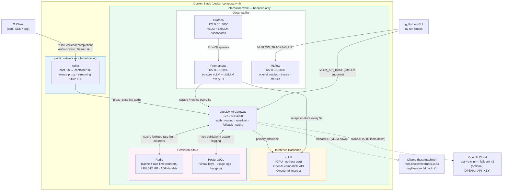

# System Architecture

Full component map of the vLLMOps stack.

```mermaid
graph TB
    Client["🌐 Client\n(curl / SDK / app)"]
    CLI["💻 Python CLI\nuv run llmops"]

    subgraph docker["Docker Stack (docker-compose.yml)"]
        subgraph pub["public network — internet-facing"]
            nginx["nginx\nhost :80 → container :80\nreverse proxy · streaming · future TLS"]
        end

        subgraph int["internal network — backend only"]
            litellm["LiteLLM AI Gateway\n127.0.0.1:4000\nauth · routing · rate-limit · fallback · cache"]

            subgraph inf["Inference Backends"]
                vllm["vLLM\n(GPU · no host port)\nOpenAI-compatible API\nQwen3-4B-Instruct"]
            end

            subgraph store["Persistent State"]
                redis["Redis\n(cache + rate-limit counters)\nLRU 512 MB · AOF durable"]
                postgres["PostgreSQL\n(virtual keys · usage logs · budgets)"]
            end

            subgraph obs["Observability"]
                prometheus["Prometheus\n127.0.0.1:9090\nscrapes vLLM + LiteLLM every 5s"]
                grafana["Grafana\n127.0.0.1:3000\nvLLM + LiteLLM dashboards"]
                mlflow["MLflow\n127.0.0.1:5000\nopenai autolog · traces · metrics"]
            end
        end
    end

    ollama["Ollama (host machine)\nhost.docker.internal:11434\ntinyllama — fallback #1"]
    openai["OpenAI Cloud\ngpt-4o-mini — fallback #2\n(optional, OPENAI_API_KEY)"]

    Client -->|"POST /v1/chat/completions\nAuthorization: Bearer sk-..."| nginx
    nginx -->|"proxy_pass (no auth)"| litellm

    litellm -->|"primary inference"| vllm
    litellm -.->|"fallback #1 (vLLM down)"| ollama
    litellm -.->|"fallback #2 (Ollama down)"| openai

    litellm <-->|"cache lookup / rate-limit counters"| redis
    litellm <-->|"key validation / usage logging"| postgres

    prometheus -->|"scrape /metrics every 5s"| vllm
    prometheus -->|"scrape /metrics every 5s"| litellm
    grafana -->|"PromQL queries"| prometheus

    CLI -->|"VLLM_API_BASE (LiteLLM endpoint)"| litellm
    CLI -->|"MLFLOW_TRACKING_URI"| mlflow

    style pub fill:#e8f4fd,stroke:#3498db
    style int fill:#eafaf1,stroke:#27ae60
    style inf fill:#fef9e7,stroke:#f39c12
    style store fill:#fdf2f8,stroke:#8e44ad
    style obs fill:#fdfefe,stroke:#95a5a6
```
